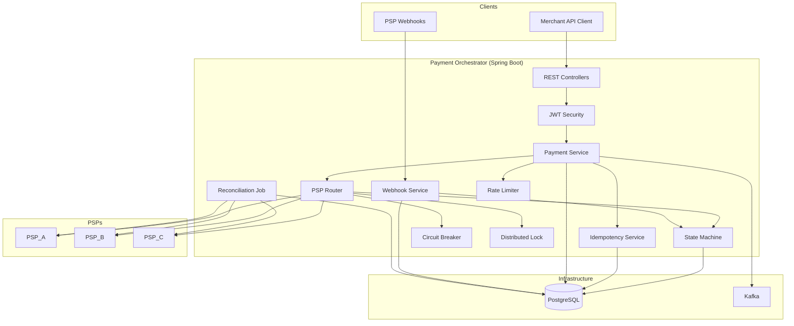
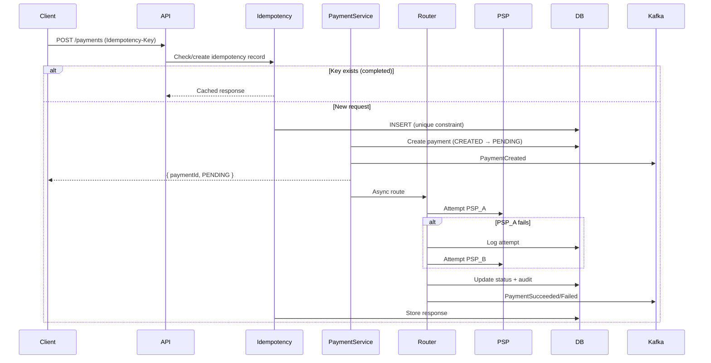
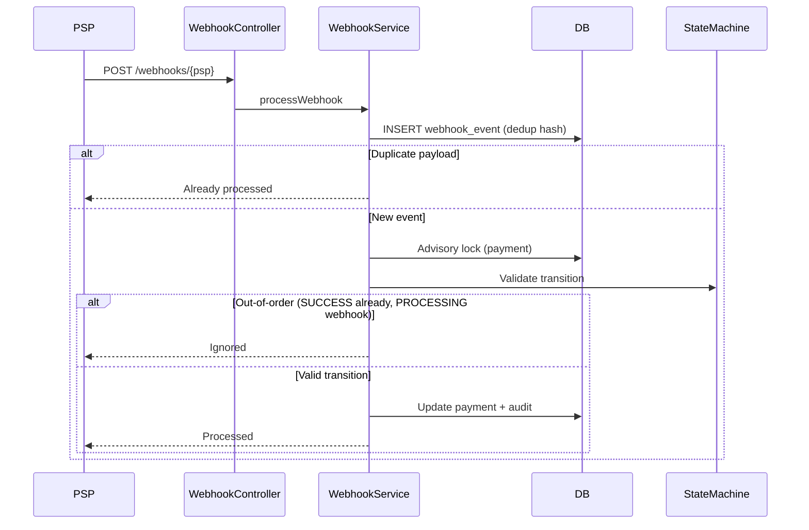
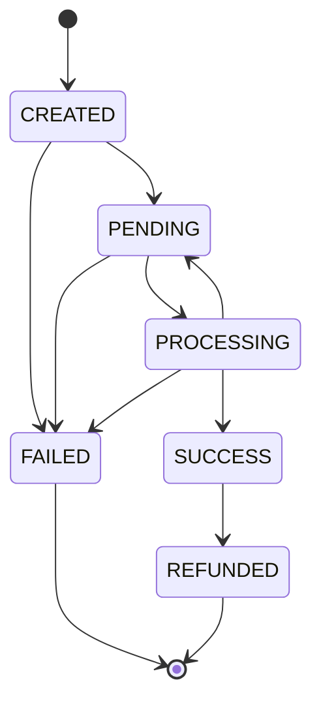

# Architecture

## System Overview

The Payment Orchestration Platform sits between merchants and multiple Payment Service Providers (PSPs). It handles payment creation, intelligent routing, failure recovery, webhook processing, and reconciliation.



## Payment Creation Flow



## Idempotency Strategy

Concurrent requests with the same `Idempotency-Key` are handled via:

1. **Database unique constraint** on `(idempotency_key, merchant_id)` — only one insert succeeds
2. **IN_PROGRESS status** — losing threads poll until completion
3. **Stored response** — all retries return identical JSON

This is safe under concurrent load without external cache.

## Webhook Processing Flow



## Event-Driven Architecture (Kafka)

**Topic:** `payment-events`

| Event Type | Trigger |
|------------|---------|
| `PaymentCreated` | Payment record created |
| `PaymentProcessing` | Routed to a PSP |
| `PaymentSucceeded` | PSP success or webhook |
| `PaymentFailed` | All PSPs exhausted or failure webhook |

**Event structure:**

```json
{
  "eventType": "PaymentCreated",
  "paymentId": "PAY001",
  "merchantId": "M123",
  "customerId": "C456",
  "amount": 100,
  "currency": "EUR",
  "status": "PENDING",
  "pspName": null,
  "correlationId": "uuid",
  "timestamp": "2026-06-15T10:00:00Z"
}
```

## State Machine



Invalid transitions (e.g., `SUCCESS → PENDING`) are rejected with HTTP 409.

## Reliability Patterns

| Pattern | Implementation |
|---------|----------------|
| Idempotency | DB unique constraint + response caching |
| Failover | Sequential PSP retry with attempt audit |
| Circuit Breaker | Per-PSP failure counter, OPEN after threshold |
| Distributed Lock | PostgreSQL `pg_advisory_xact_lock` |
| Rate Limiting | Per-merchant sliding window in DB |
| Reconciliation | Hourly job queries PSP for stuck payments |

## Security Model

- **JWT Bearer tokens** on all `/payments/**` endpoints
- **MERCHANT** role: access only own merchant's payments
- **ADMIN** role: access all payments
- Webhooks are unauthenticated (production would use HMAC signature verification)

## Observability

- **Correlation IDs** via `X-Correlation-Id` header (auto-generated if absent)
- **Structured logging** with correlation ID in MDC
- **Micrometer metrics**: `payment.created`, `payment.success`, `psp.latency`, `rate_limit.exceeded`
- **Actuator**: `/actuator/health`, `/actuator/prometheus`
