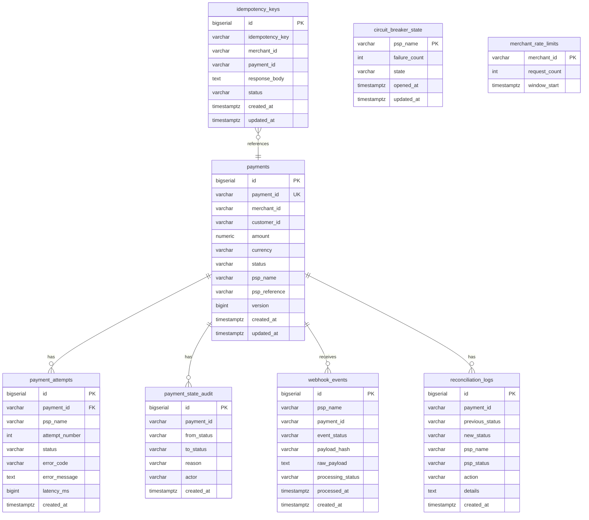

# Database Schema

## Entity Relationship Diagram

## Table Descriptions

### payments

Core payment records. Optimistic locking via `version` column prevents lost updates during concurrent webhook/state changes.

| Column | Purpose |
|--------|---------|
| `payment_id` | Business identifier (e.g., PAY001) |
| `status` | Current state in the state machine |
| `psp_name` | PSP that processed (or is processing) the payment |
| `version` | JPA `@Version` for optimistic concurrency |

### payment_attempts

Complete audit trail of PSP routing attempts. One row per PSP tried, including failures, timeouts, and latency.

### idempotency_keys

Ensures exactly-once payment creation per `(idempotency_key, merchant_id)` pair.

| Status | Meaning |
|--------|---------|
| `IN_PROGRESS` | Payment creation in flight |
| `COMPLETED` | Response cached and safe to replay |
| `FAILED` | Creation failed; retries should not auto-succeed |

**Unique constraint:** `(idempotency_key, merchant_id)` — the primary concurrency guard.

### webhook_events

Stores every webhook received with SHA-256 payload hash for deduplication.

**Unique constraint:** `(psp_name, payment_id, payload_hash)`

### reconciliation_logs

Audit log for the hourly reconciliation job actions.

### payment_state_audit

Immutable log of every state transition with reason and actor (system, webhook, reconciliation).

### circuit_breaker_state

Tracks per-PSP failure counts and OPEN/CLOSED/HALF_OPEN state.

### merchant_rate_limits

Sliding window counter for merchant-level rate limiting.

## Design Decisions

1. **Separate audit tables** rather than JSON blobs — enables efficient querying and compliance reporting.
2. **Advisory locks** instead of Redis — reduces infrastructure dependencies while providing transaction-scoped locking.
3. **Optimistic locking on payments** — `@Version` prevents race conditions between webhooks and async routing.
4. **Idempotency response stored as JSON text** — simple replay without re-executing business logic.
5. **No soft deletes** — payment records are immutable for audit integrity.

## Indexes

| Table | Index | Purpose |
|-------|-------|---------|
| payments | merchant_id | Merchant-scoped queries |
| payments | status | Reconciliation job |
| payment_attempts | payment_id | Attempt history lookup |
| webhook_events | payment_id | Webhook audit lookup |

## Migrations

Managed by Flyway: `src/main/resources/db/migration/V1__init_schema.sql`
